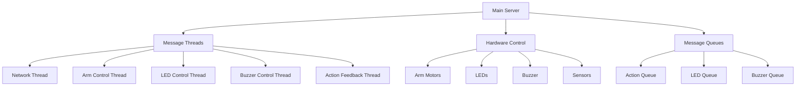
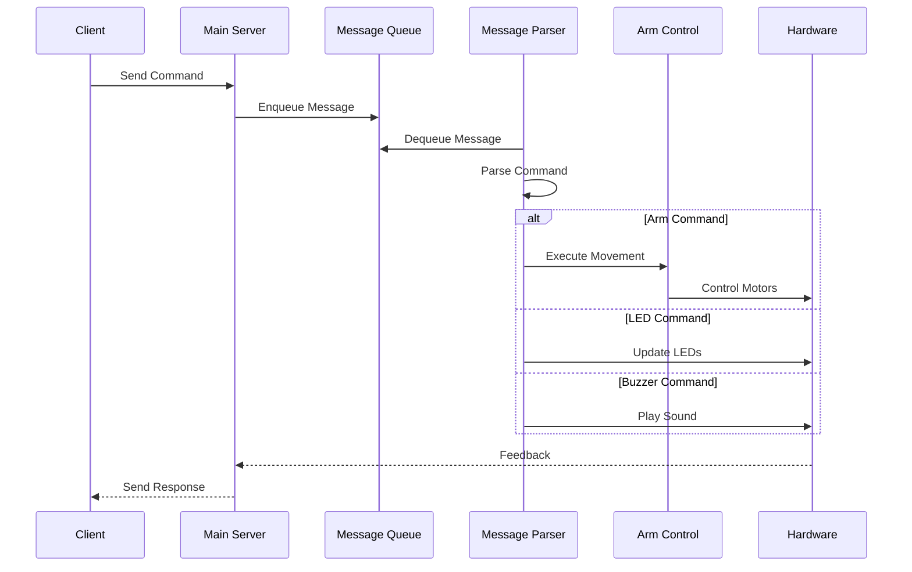

# Freenove Robot Arm Kit - Code Architecture

## System Overview

## Core Components

### 1. Main Server (`main.py`)

#### Core Functionality
- Central control unit for the robot arm system
- Manages all hardware components and communication
- Handles command processing and execution
- Maintains system state and configuration

#### Initialization Process
1. **Hardware Initialization**
   - Initializes arm, servo, LED, and buzzer components
   - Loads configuration from JSON files
   - Sets up initial positions and calibration data

2. **Thread Initialization**
   - Creates and starts the server check thread
   - Initializes message queues for different command types
   - Sets up thread-safe communication channels

#### Thread Management
- **Server Check Thread**: Monitors and manages server state
- **Receive Thread**: Handles incoming commands from clients
- **Action Thread**: Processes movement commands
- **LED Thread**: Manages LED lighting patterns
- **Buzzer Thread**: Handles audio feedback
- **Feedback Thread**: Provides command execution status

#### Command Processing
1. **Command Reception**
   - Listens on TCP/IP socket (port 5000)
   - Accepts client connections
   - Receives and parses incoming commands

2. **Command Types**
   - **Movement Commands (G-code)**: Control arm positioning
   - **LED Commands**: Control lighting patterns and colors
   - **Buzzer Commands**: Handle audio feedback
   - **Calibration Commands**: Configure arm positioning
   - **System Commands**: Control server operation

3. **Command Execution**
   - Commands are routed to appropriate queues
   - Each thread processes its respective queue
   - Feedback is sent back to the client

#### Calibration System
- **Home Point Calibration**: Sets reference position
- **Plane Calibration**: Calibrates X-Z and Y-Z planes
- **Sensor Calibration**: Configures sensor center point
- **Point Calibration**: Sets reference points for movement

#### Safety Features
- Validates movement ranges
- Prevents unsafe operations
- Provides error feedback
- Graceful error recovery

#### State Management
- Tracks arm position and state
- Manages configuration persistence
- Handles error conditions
- Maintains connection state

### 2. Hardware Control Modules

#### Arm Control (`arm.py`)
- Controls robot arm movements
- Handles kinematics calculations
- Manages motor control
- Implements movement constraints

#### Stepper Motor Control (`stepmotor.py`)
- Low-level motor control
- Handles motor steps and directions
- Manages motor timing

#### Servo Control (`servo.py`)
- Controls servo motors
- Handles angle positioning

#### LED Control (`ledPixel.py`)
- Manages LED lighting
- Handles color and pattern control

#### Buzzer Control (`buzzer.py`)
- Manages sound output
- Handles tones and patterns

### 3. Message Handling

#### Message Threads (`messageThread.py`)
- Manages concurrent operations
- Handles thread creation/termination
- Ensures thread safety

#### Message Queue (`messageQueue.py`)
- Thread-safe message passing
- Buffers commands
- Manages command priorities

#### Message Parser (`messageParser.py`)
- Parses incoming commands
- Validates message format
- Routes commands to appropriate handlers

### 4. Data Management

#### Message Record (`messageRecord.py`)
- Handles data persistence
- Manages configuration files
- Stores/retrieves settings

## Data Flow

## Error Handling
- Thread-safe operations
- Command validation
- Hardware feedback monitoring
- Emergency stop handling

## Configuration
- Stored in JSON format
- Includes:
  - Motor parameters
  - Arm dimensions
  - Speed/acceleration settings
  - Calibration data
